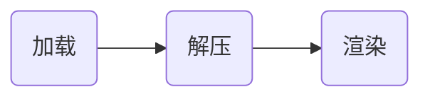

# iOS之图片的加载

* 认识一下图片加载
* 常用图片简介
* 添加图片到工程
* 本地图片加载
* 网络图片加载
* 缓存机制
* 实时流图
* 图片的contentType
* 图片加载存在的问题
* 多线程 + 向下采样
* 预解码 + 多线程 + 向下采样
* 性能

### 认识一下图片加载
* Q：怎么从手机中加载一张图片？
* A：
    * 1:从磁盘加载一张图片（这张图片是未解压缩的）
    * 2:将生成的UIImage赋值给UIImageView
    * 3:接着一个隐式的CATransaction捕获到了UIImageView的图层变换
    * 4:在主线程的下一个runloop到来时，Core Animation提交这个隐式的transaction
        * 4.1分配内存缓存区用来管理IO和解压缩
        * 4.2将文件数据从磁盘读取到内存
        * 4.3将压缩的图片数据解码成未压缩的位图（在主线程一个非常耗时的内存操作）
        * 4.4最后CoreAnimation中CALayer使用未压缩的位图渲染UIImageView的图层
    * 5:渲染流程
        * 5.1GPU获取图片的坐标
        * 5.2将坐标交个顶点着色器
        * 5.3将图片光栅化
        * 5.4从帧缓存区渲染到屏幕



### 常用图片简介
* JPEG
有损压缩、精确控制压缩比、无透明通道、文件较小

* PNG
无损压缩、较小的压缩比、透明通道、文件较大

### 添加图片到工程
* 直接添加到工程
	* 把图片文件拖拽到工程中

* 添加到 Assets.xcassets
	* Assets.xcassets 是苹果用来管理优化App图片的一个工具，在iOS8.0以上版本时（包括8.0）,打包的资源包图片被放在Assets.car中 ,图片被压缩。8.0以下时，和直接拖到工程中的图片，都存在MainBudnle中，没有压缩优化。
	* 准备好两倍、三倍像素的图片
	* 
	* 
	* 
	
### 本地图片加载
*  ContentsOfFile
	* 对象被释放掉之后，图片内存也会被释放
	* 相同的图片会被重复加载到内存中
	* 无法加载 Assets.xcassets 中的图片
	* 在实时性不高，使用频率不高、内存紧张时使用 

``` 
self.image = UIImage.init(contentsOfFile: Bundle.main.path(forResource: "06", ofType: "jpg") ?? "")
self.imageView = UIImageView.init(image: self.image )
self.imageView?.frame = CGRect.init(x: 0, y: 0, width:UIScreen.main.bounds.size.width, height: 200)
self.view.addSubview(self.imageView!)
```

* ImageWithName
	* 被加载后图片会常驻内存
	* 和Assets.xcassets 配合，可以自动匹配对应分辨率的图片,并且可以不带图片格式
	* 加载Assets.xcassets 以外的图片，需要全名（带格式比如：01.png）
	
``` 
self.image = UIImage.init(named: "07.jpg")
self.imageView = UIImageView.init(image: self.image )
self.imageView?.frame = CGRect.init(x: 0, y: 0, width:UIScreen.main.bounds.size.width, height: 200)
self.view.addSubview(self.imageView!)
```

### 网络图片加载
* 使用原生API加载
```
extension UIImageView{
    func downloadImageWithUrlStr(imageurl : String){
        guard !imageurl.isEmpty else {return}
        //编码特殊字符串
        let encodeUrl = imageurl.addingPercentEncoding(withAllowedCharacters: .urlQueryAllowed)
        URLSession.shared.dataTask(with: URLRequest(url: URL(string: encodeUrl!)!), completionHandler: {
            (data, response, error) -> Void in
            if error != nil{
                print(error.debugDescription)
            } else {
                //将图片数据赋予UIImage
                let img = UIImage(data:data!)
                
                // 这里需要改UI，需要回到主线程
                DispatchQueue.main.async {
                    self.image = img
                }
            }
        }).resume()
    }
}
```


### 缓存机制
* 下载缓存： 下载过的图片无需再次下载
* 内存缓存： 解压的图片是耗费较多cpu 计算得到的结果，应该缓存起来
* 文件缓存：下载过的图片可以存储在本地，再次启动时可以直接从本地获取
* 上述的几个点同时都得考虑到，所以想要写一个完善高效的图片缓存是一件挺耗时的事情，幸运的是现在有一些直接可以用的轮子
    * SDWebImage
    * AFNetwork
    * Kingfisher (swift)

### 实时流图
```
//拼接数据
imageData?.append(data)
    
let finished = (imageData!.count == dataTask.countOfBytesExpectedToReceive)
if finished {
    print("")
}
//创建空图片空间
let emptySpace = CGImageSourceCreateIncremental(nil);

//更新图片空间数据
CGImageSourceUpdateData(emptySpace, imageData! as CFData, finished);

//绘制图片
let imageRef = CGImageSourceCreateImageAtIndex(emptySpace, 0, nil);

//CGImageRef -> UIImage
let image = UIImage.init(cgImage: imageRef!, scale: 1.0, orientation: .up)

//显示图片
DispatchQueue.main.async {
    self.image = image;
}
```
<figure class="video_container">
  <video controls="true" allowfullscreen="true" poster="path/to/poster_image.png">
    <source src="01.mp4" type="video/mp4">
  </video>
</figure>

### 图片的contentType
* scaleToFill ： 图片变形去匹配imageview （默认）
*  scaleAspectFit : 图片保持真实比例，从视图中心点扩张，直到任意一边到imageview 的边界 
*  scaleAspectFill : 图片保持真实比例，从视图中心点扩张，直到全部边到imageview 的边界（可能有些图片或冲破imageview 的边界） 

### 图片加载存在的问题
* 解码时占用太多的cpu，在主线程解码容易阻塞，掉帧
* 图片解码后占用内存太大
    
### 向下采样 
* 通常在列表中的图片并不需要特别“高分辨率”，因为它们往往一闪而过；
* 图片在内存中的大小并不根据它们原始文件的大小，而是跟它们的像素和格式有关系，用rgba格式的图片来举例，那么一张 512 * 512 （图片大小几百kb） 的rgba图片，在被加载和解码之后在内存中会占用 512 * 512 * 4 / 1000 / 1000 ～= 1M 的内存
* 那么可以通过在解码时，创建一个较小的位图，比如 512 =》100 那么 100 * 100 * 4 / 1000 /1000 ～= 0.04M
* 改函数可以较大的降低图片消耗内存，且有效的降低cpu的负荷

```
public static func downsampleImage(at URL:NSURL, maxSize:Float) -> Image {
    let sourceOptions = [kCGImageSourceShouldCache:false] as CFDictionary
    let source = CGImageSourceCreateWithURL(URL as CFURL, sourceOptions)!
    let downsampleOptions = [kCGImageSourceCreateThumbnailFromImageAlways:true,     //是否创建缩略图
                             kCGImageSourceThumbnailMaxPixelSize:maxSize,           //最大采样数
                             kCGImageSourceShouldCacheImmediately:true,             //是否立即解码
                             kCGImageSourceCreateThumbnailWithTransform:true,
                             ] as CFDictionary
    let downsampledImage = CGImageSourceCreateThumbnailAtIndex(source, 0, downsampleOptions)!
    return Image(cgImage: downsampledImage)
}
```

### 多线程 + 向下采样
* 在列表被快速的滑动时，此时cpu会因一直解压图片而暴涨，如果此时图片的解码刚好是在主线程时，那么恭喜你，你基本能看到app开发中最经常遇到的问题：掉帧（滑动时有卡顿的现象）。
* 要解决这个问题，可以在多线程中，进行图片解码的操作，然后返回解码后的图片给主线程使用；⚠️如果使用全局并行队列，有可能在快速滑动时造成线程爆炸（每一个解码一个线程，直到线程资源用完；线程的切换也是会耗费资源的，这么多线程之间的切换也会占用不少的cpu资源），**解决方法是：使用异步串行队列来处理解码。**
```
//优化：串行异步程解码 + 向下采样
static let downsampleSerialQueue:DispatchQueue = DispatchQueue.init(label: "downsampleSerialQueue", qos: .default, attributes: [], autoreleaseFrequency: .workItem, target: nil)
public static func asyncDownsampleImage(at URL:NSURL, maxSize:Float, complete:@escaping(Image)->()) {
    downsampleSerialQueue.async {
        let image = Image.downsampleImage(at: URL, maxSize: maxSize)
        DispatchQueue.main.async {
            complete(image)
        }
    }
}
```

### 预解码 + 多线程 + 向下采样
* 如果你觉得上面的方式还不够快，那么可以找个适当的时机，**提前把图片解码！**然后再把解码的图片给视图显示

### 性能
* 
* 
* [demo工程地址](https://github.com/developeryh/Image)

